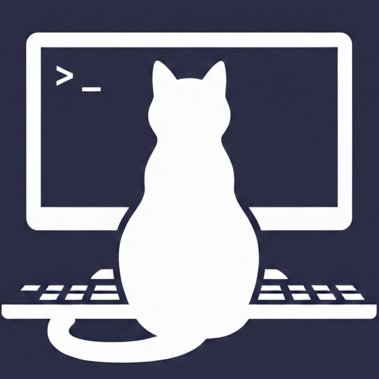

<p align="center">
  
</p>

# Betty

A real-time TUI monitor for Claude Code sessions.

## Install

```bash
curl -fsSL https://betty4.sh/install.sh | bash
```

Or directly with uv / pip:

```bash
uvx betty              # run without installing
uv tool install betty  # install permanently
pip install betty      # with pip
```

## Use

```bash
# Start betty
betty

# In another terminal, run Claude Code as usual
claude
```

The companion auto-detects your session. No hooks or configuration needed.

## Options

| Flag | Description |
|------|-------------|
| `--global`, `-g` | Watch all projects |
| `--worktree`, `-w` | Watch across git worktrees |
| `--style` | UI style (`rich` or `claude-code`) |
| `--version`, `-v` | Show version |

## Commands

| Command | Description |
|---------|-------------|
| `config` | Configure LLM summarization and UI settings |
| `mock --demo` | Generate mock sessions for development |

## Keybindings

| Key | Action |
|-----|--------|
| `j/k` | Navigate turns |
| `g/G` | Jump to beginning/end |
| `o` / `Space` | Expand/collapse turn |
| `e/c` | Expand/collapse all |
| `1-9` | Switch sessions |
| `s/S` | Toggle summaries / Summarize all |
| `f` | Cycle filters |
| `T/P` | Tasks / Plan view |
| `m` | Edit monitor instructions |
| `?` | Ask about trace |
| `x` | Export to Markdown |
| `D` | Delete session |
| `q` | Quit |

See all keybindings in the TUI status bar.

## License

MIT
